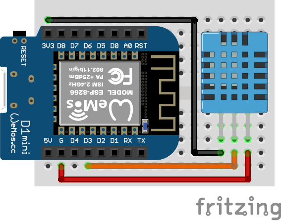

# IoT Sensors

A project setting up WebThings IoT temperature and humidity sensors using ESP8266 boards, DHT11, and DHT22 sensors.

Read more about the project [here](https://medium.com/@oscarschafer28/iot-sensors-webthings-gateway-7db188f25182).

### Wiring diagram

